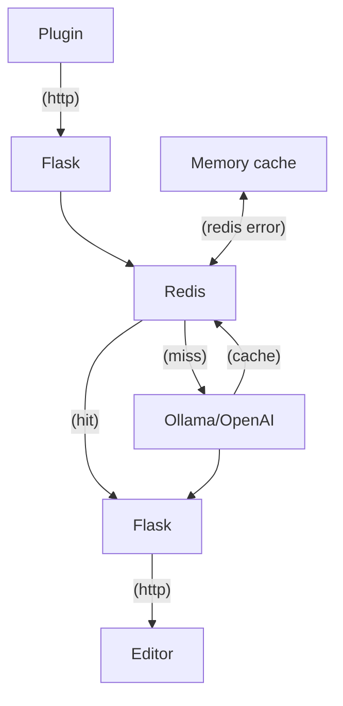
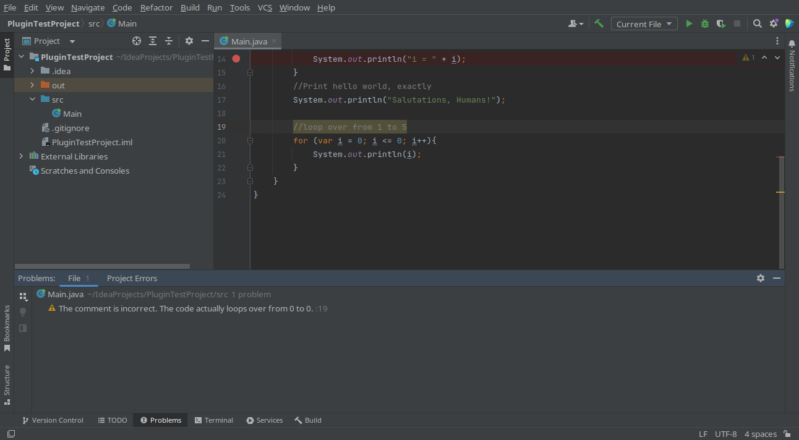

# Sanity Check

A plugin that uses a language models to alert you when your comments describe functionality not present in the code.

Example:
```java
// Print the numbers 1 to 10
for (int i = 0; i < 10; i++) {
    System.out.println(i);
}
```

Plugin output: this code will print the numbers 0 to 9, not 1 to 10.

**WARNING**: This plugin is in development and often gives incorrect results. This code is provided 'as is' and should be regarded as a proof of concept and nothing more.

### Requirements:

- To use local language models: Ollama running on localhost at the default port, this can be changed in the langchainllmprovider 
- To use OpenAI language models: An OpenAI API key. This should be placed in the CONFIG.py file 
```"OPENAI_API_KEY": "YOUR API KEY"```
- Support for other language models/hosting platforms can be added by adding more llm providers and updating the code in app.py to use them.
- Redis server running on localhost:6379, or the port specified in app.py file. 
If this is not present, an in-memory cache will be used instead.

The plugin depends on the Flask server. The location of this can be changed in the plugin settings, but defaults to http://localhost:5000/ask
The language model can be configured in the plugin settings, but defaults to the OpenAI GPT-3.5 model. The default prompt is also optimised for this model.

### To run:
- Run redis 
- Run the Ollama server
- Run the Flask server
- Install the plugin in your editor or use the JetBrains plugin development tools to run the plugin in a test environment (recommended)

## Architecture


Example of the plugin in action:



Known issues:
- We are using soon to be deprecated option to annotate the code. I am working on getting the new options to work
- Multiline comments will have separate warnings for each line
- Lack of test coverage, this is a work in progress